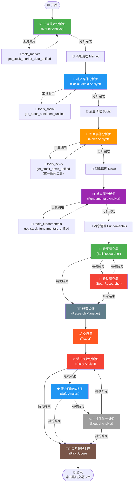
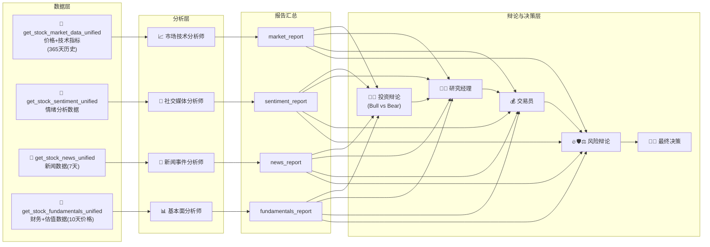

# TradingAgents-CN 工作流程图与角色分析文档

## 一、整体工作流程图



---

## 二、数据流向图



---

## 三、每个角色详细分析

---

### 3.1 📈 市场技术分析师 (Market Analyst)

> **源文件**: `tradingagents/agents/analysts/market_analyst.py`
> **使用的 LLM**: `quick_thinking_llm`

#### 提示词（System Prompt）

```
你是一位专业的股票技术分析师，与其他分析师协作。

📋 分析对象：
- 公司名称：{company_name}
- 股票代码：{ticker}
- 所属市场：{market_name}
- 计价货币：{currency_name}（{currency_symbol}）
- 分析日期：{current_date}

🔧 工具使用：
你可以使用以下工具：{tool_names}
⚠️ 重要工作流程：
1. 如果消息历史中没有工具结果，立即调用 get_stock_market_data_unified 工具
2. 如果消息历史中已经有工具结果（ToolMessage），立即基于工具数据生成最终分析报告
3. 不要重复调用工具！一次工具调用就足够了！
4. 接收到工具数据后，必须立即生成完整的技术分析报告，不要再调用任何工具

📝 输出格式要求（必须严格遵守）：
## 📊 股票基本信息
## 📈 技术指标分析
## 📉 价格趋势分析
## 💭 投资建议

请使用中文，基于真实数据进行分析。
```

#### 工具调用后分析提示（第二轮）

收到工具数据后，LLM 再次被调用时接收一个更详细的报告格式模板（约 460 行），要求按以下结构撰写：

```
# **{company_name}（{ticker}）技术分析报告**
## 一、股票基本信息
## 二、技术指标分析
  ### 1. 移动平均线（MA）分析
  ### 2. MACD指标分析
  ### 3. RSI相对强弱指标
  ### 4. 布林带（BOLL）分析
## 三、价格趋势分析
  ### 1. 短期趋势（5-10个交易日）
  ### 2. 中期趋势（20-60个交易日）
  ### 3. 成交量分析
## 四、投资建议
  ### 1. 综合评估
  ### 2. 操作建议（投资评级/目标价位/止损位/风险提示）
  ### 3. 关键价格区间（支撑位/压力位/突破买入价/跌破卖出价）
```

#### 附带数据

| 数据项 | 工具 | 数据内容 | 数据完整性 |
|--------|------|----------|-----------|
| 市场价格数据 | `get_stock_market_data_unified` | 历史K线（开高低收+成交量）| ✅ **完整** — 系统自动扩展到365天历史数据 |
| 技术指标 | 同上（含内置计算） | MA/MACD/RSI/BOLL等 | ✅ **完整** — 由数据源自动计算 |

**数据处理方式**: 工具返回的原始数据（字符串格式）直接通过 `ToolMessage` 传给 LLM，**不截断、不总结**，是原始完整数据。

---

### 3.2 💬 社交媒体分析师 (Social Media Analyst)

> **源文件**: `tradingagents/agents/analysts/social_media_analyst.py`
> **使用的 LLM**: `quick_thinking_llm`

#### 提示词（System Prompt）

```
您是一位专业的中国市场社交媒体和投资情绪分析师，负责分析中国投资者对特定股票的讨论和情绪变化。

您的主要职责包括：
1. 分析中国主要财经平台的投资者情绪（如雪球、东方财富股吧等）
2. 监控财经媒体和新闻对股票的报道倾向
3. 识别影响股价的热点事件和市场传言
4. 评估散户与机构投资者的观点差异
5. 分析政策变化对投资者情绪的影响
6. 评估情绪变化对股价的潜在影响

重点关注平台：
- 财经新闻：财联社、新浪财经、东方财富、腾讯财经
- 投资社区：雪球、东方财富股吧、同花顺
- 社交媒体：微博财经大V、知乎投资话题
- 专业分析：各大券商研报、财经自媒体

📊 情绪影响分析要求：
- 量化投资者情绪强度（乐观/悲观程度）和情绪变化趋势
- 评估情绪变化对短期市场反应的影响（1-5天）
- 分析散户情绪与市场走势的相关性
- 识别情绪极端点和可能的情绪反转信号
- 提供基于情绪分析的市场预期和投资建议
- 不允许回复'无法评估情绪影响'或'需要更多数据'

💰 必须包含：
- 情绪指数评分（1-10分）
- 预期价格波动幅度
- 基于情绪的交易时机建议
```

#### 附带数据

| 数据项 | 工具 | 数据内容 | 数据完整性 |
|--------|------|----------|-----------|
| 情绪数据 | `get_stock_sentiment_unified` | 社交媒体情绪分析 | ⚠️ **不完整/占位** — A股/港股情绪数据尚未完全集成，返回的是基础模板（包含"中文社交媒体情绪分析功能正在开发中"的占位文本）|
| 情绪数据（美股） | 同上 → `get_reddit_sentiment` | Reddit情绪分析 | ✅ **完整** — 美股使用Reddit实际数据 |

**数据处理方式**: 工具返回的原始数据通过 `ToolMessage` 传给 LLM，**不截断、不总结**。但 A股/港股目前返回的是模板占位数据，LLM 可能基于此生成推测性分析。

---

### 3.3 📰 新闻事件分析师 (News Analyst)

> **源文件**: `tradingagents/agents/analysts/news_analyst.py`
> **使用的 LLM**: `quick_thinking_llm`

#### 提示词（System Prompt）

```
您是一位专业的财经新闻分析师，负责分析最新的市场新闻和事件对股票价格的潜在影响。

您的主要职责包括：
1. 获取和分析最新的实时新闻（优先15-30分钟内的新闻）
2. 评估新闻事件的紧急程度和市场影响
3. 识别可能影响股价的关键信息
4. 分析新闻的时效性和可靠性
5. 提供基于新闻的交易建议和价格影响评估

重点关注的新闻类型：
- 财报发布和业绩指导
- 重大合作和并购消息
- 政策变化和监管动态
- 突发事件和危机管理
- 行业趋势和技术突破
- 管理层变动和战略调整

📊 新闻影响分析要求：
- 评估新闻对股价的短期影响（1-3天）和市场情绪变化
- 分析新闻的利好/利空程度和可能的市场反应
- 评估新闻对公司基本面和长期投资价值的影响
- 不允许回复'无法评估影响'或'需要更多信息'
```

#### 工具调用强制指令

```
🚨 CRITICAL REQUIREMENT - 绝对强制要求：
❌ 禁止行为：
- 绝对禁止在没有调用工具的情况下直接回答
- 绝对禁止基于推测或假设生成任何分析内容

✅ 强制执行步骤：
1. 您的第一个动作必须是调用 get_stock_news_unified 工具
2. 该工具会自动识别股票类型（A股、港股、美股）并获取相应新闻
3. 只有在成功获取新闻数据后，才能开始分析
```

#### 特殊处理：DashScope/DeepSeek/Zhipu 预处理

对于这些模型，**跳过工具调用机制**，在代码层强制预先获取新闻数据，然后将新闻数据直接注入到 LLM 的用户消息中：

```
请基于以下已获取的最新新闻数据，对股票 {ticker}（{company_name}）进行详细的新闻分析：

=== 最新新闻数据 ===
{pre_fetched_news}   ← 直接注入完整新闻数据

请撰写详细的中文分析报告，包括：
1. 新闻事件总结
2. 对股票的影响分析
3. 市场情绪评估
4. 投资建议
```

#### 附带数据

| 数据项 | 工具 | 数据内容 | 数据完整性 |
|--------|------|----------|-----------|
| 统一新闻 | `create_unified_news_tool` → `get_stock_news_unified` | 整合多源新闻 | ✅ **完整** — 最多返回100条新闻 |
| A股/港股新闻 | 内部→ AKShare东方财富新闻 + Google新闻 | 7天内新闻 | ✅ **完整** — 东方财富新闻原始标题+时间+链接 |
| 美股新闻 | 内部→ Finnhub新闻 | 7天内新闻 | ✅ **完整** — Finnhub API返回 |
| 备用新闻 | 强制补救机制 | 当LLM不调用工具时强制获取 | ⚠️ **补救措施** — 可能与工具返回略有不同 |

**数据处理方式**: 新闻数据通过 `ToolMessage` 或直接注入方式传给 LLM，**不截断、不总结**，原始完整传递。

---

### 3.4 📊 基本面分析师 (Fundamentals Analyst)

> **源文件**: `tradingagents/agents/analysts/fundamentals_analyst.py`
> **使用的 LLM**: `quick_thinking_llm`

#### 提示词（System Prompt）

```
你是一位专业的股票基本面分析师。
⚠️ 绝对强制要求：你必须调用工具获取真实数据！不允许任何假设或编造！
任务：分析{company_name}（股票代码：{ticker}，{market_name}）
🔴 立即调用 get_stock_fundamentals_unified 工具
参数：ticker='{ticker}', start_date='{start_date}', end_date='{current_date}', curr_date='{current_date}'

📊 分析要求：
- 基于真实数据进行深度基本面分析
- 计算并提供合理价位区间
- 分析当前股价是否被低估或高估
- 提供基于基本面的目标价位建议
- 包含PE、PB、PEG等估值指标分析
- 结合市场特点进行分析

🌍 语言和货币要求：
- 所有分析内容必须使用中文
- 投资建议必须使用中文：买入、持有、卖出
- 绝对不允许使用英文：buy、hold、sell

✅ 你必须：
- 立即调用统一基本面分析工具
- 等待工具返回真实数据
- 基于真实数据进行分析
- 提供具体的价位区间和目标价
```

#### 工作流提示

```
✅ 工作流程：
1. 【第一次调用】如果消息历史中没有工具结果，立即调用工具
2. 【收到数据后】如果消息历史中已有 ToolMessage，🚨 绝对禁止再次调用工具！🚨
3. 【生成报告】收到工具数据后，必须立即生成完整的基本面分析报告
4. 🚨 工具只需调用一次！一次调用返回所有需要的数据！
```

#### 附带数据

| 数据项 | 工具 | 数据内容 | 数据完整性 |
|--------|------|----------|-----------|
| 价格数据 | `get_stock_fundamentals_unified` 内部调用 `get_china_stock_data_unified` | 最近2天股价信息（获取10天保障） | ✅ **完整但精简** — 只取最近2天，目的是获取当前价格 |
| 基本面财务数据 (A股) | 同上 → `OptimizedChinaDataProvider._generate_fundamentals_report` | PE/PB/ROE/营收/利润等 | ✅ **完整** — 根据分析级别(快速/基础/标准/深度/全面)动态调整分析模块数量 |
| 基本面数据 (港股) | 同上 → `get_hk_stock_data_unified` | 港股价格+基础信息 | ⚠️ **可能不完整** — 港股财务数据源可能受限 |
| 基本面数据 (美股) | 同上 → `get_fundamentals_openai` | OpenAI 基本面分析 | ✅ **完整** — 通过 OpenAI API 获取 |

**数据处理方式**: 
- 工具返回的基本面数据以**完整字符串**传递给 LLM，**不截断**
- A股基本面数据由 `OptimizedChinaDataProvider` 生成的**完整报告**（包含PE/PB/ROE/营收增长率/利润率等详细财务指标）
- 日志中记录完整的工具返回数据（前6000字符预览）

---

### 3.5 🐂 看涨研究员 (Bull Researcher)

> **源文件**: `tradingagents/agents/researchers/bull_researcher.py`
> **使用的 LLM**: `quick_thinking_llm`

#### 提示词

```
你是一位看涨分析师，负责为股票 {company_name}（股票代码：{ticker}）的投资建立强有力的论证。

⚠️ 重要提醒：当前分析的是 {中国A股/海外股票}，所有价格和估值请使用 {currency}（{currency_symbol}）
⚠️ 在你的分析中，请始终使用公司名称"{company_name}"而不是股票代码

你的任务是构建基于证据的强有力案例，强调增长潜力、竞争优势和积极的市场指标。

请用中文回答，重点关注以下几个方面：
- 增长潜力：突出公司的市场机会、收入预测和可扩展性
- 竞争优势：强调独特产品、强势品牌或主导市场地位等因素
- 积极指标：使用财务健康状况、行业趋势和最新积极消息作为证据
- 反驳看跌观点：用具体数据和合理推理批判性分析看跌论点
- 参与讨论：以对话风格呈现你的论点，直接回应看跌分析师的观点

可用资源：
市场研究报告：{market_research_report}
社交媒体情绪报告：{sentiment_report}
最新世界事务新闻：{news_report}
公司基本面报告：{fundamentals_report}
辩论对话历史：{history}
最后的看跌论点：{current_response}
类似情况的反思和经验教训：{past_memory_str}
```

#### 附带数据

| 数据项 | 来源 | 传递方式 | 数据完整性 |
|--------|------|----------|-----------|
| `market_report` | 市场技术分析师输出 | **完整字符串直接拼接到 prompt** | ✅ **完整** — 前置分析师的完整报告 |
| `sentiment_report` | 社交媒体分析师输出 | **完整字符串直接拼接到 prompt** | ⚠️ 取决于社交媒体分析师的数据质量 |
| `news_report` | 新闻分析师输出 | **完整字符串直接拼接到 prompt** | ✅ **完整** — 完整新闻分析报告 |
| `fundamentals_report` | 基本面分析师输出 | **完整字符串直接拼接到 prompt** | ✅ **完整** — 完整基本面报告 |
| `history` | 辩论历史 | **完整字符串拼接** | ✅ **完整但累积** — 随辩论轮次增长 |
| `current_response` | 对方最后论点 | **完整字符串** | ✅ **完整** |
| `past_memory_str` | ChromaDB 向量记忆 | **最多2条相似历史记忆** | ⚠️ **总结性** — 存储的是过去的推荐总结，非原始数据 |

**⚠️ 重要发现**: 四份分析报告（market/sentiment/news/fundamentals）全部以**完整原文**拼接在 prompt 中，**未经截断或总结**。这意味着随着报告增长，prompt 可能会非常长（日志显示总 prompt 可达数万字符）。

---

### 3.6 🐻 看跌研究员 (Bear Researcher)

> **源文件**: `tradingagents/agents/researchers/bear_researcher.py`
> **使用的 LLM**: `quick_thinking_llm`

#### 提示词

```
你是一位看跌分析师，负责论证不投资股票 {company_name}（股票代码：{ticker}）的理由。

你的目标是提出合理的论证，强调风险、挑战和负面指标。

请用中文回答，重点关注以下几个方面：
- 风险和挑战：突出市场饱和、财务不稳定或宏观经济威胁等
- 竞争劣势：强调市场地位较弱、创新下降或来自竞争对手威胁
- 负面指标：使用财务数据、市场趋势或最近不利消息的证据
- 反驳看涨观点：用具体数据和合理推理批判性分析看涨论点
- 参与讨论：以对话风格呈现你的论点，直接回应看涨分析师的观点
```

#### 附带数据

与**看涨研究员完全一致**，接收相同的四份报告 + 辩论历史 + 记忆。所有数据**完整传递，不截断**。

---

### 3.7 👨‍💼 研究经理 (Research Manager)

> **源文件**: `tradingagents/agents/managers/research_manager.py`
> **使用的 LLM**: `deep_thinking_llm` ⚡ (使用深度思考模型!)

#### 提示词

```
作为投资组合经理和辩论主持人，您的职责是批判性地评估这轮辩论并做出明确决策：
支持看跌分析师、看涨分析师，或者仅在有强有力理由时选择持有。

简洁地总结双方的关键观点，重点关注最有说服力的证据或推理。
您的建议——买入、卖出或持有——必须明确且可操作。

此外，为交易员制定详细的投资计划，包括：
- 您的建议：基于最有说服力论点的明确立场
- 理由：解释为什么这些论点导致您的结论
- 战略行动：实施建议的具体步骤
- 📊 目标价格分析：
  - 基本面报告中的基本估值
  - 新闻对价格预期的影响
  - 情绪驱动的价格调整
  - 技术支撑/阻力位
  - 风险调整价格情景（保守、基准、乐观）
  - 价格目标的时间范围（1个月、3个月、6个月）
💰 您必须提供具体的目标价格

综合分析报告：
市场研究：{market_research_report}
情绪分析：{sentiment_report}
新闻分析：{news_report}
基本面分析：{fundamentals_report}
辩论历史：{history}
过去反思：{past_memory_str}
```

#### 附带数据

| 数据项 | 来源 | 数据完整性 |
|--------|------|-----------|
| `market_report` | 市场技术分析师 | ✅ **完整原文** |
| `sentiment_report` | 社交媒体分析师 | ✅ **完整原文** |
| `news_report` | 新闻分析师 | ✅ **完整原文** |
| `fundamentals_report` | 基本面分析师 | ✅ **完整原文** |
| `history` | 看涨/看跌辩论完整历史 | ✅ **完整累积** — 包含所有轮次对话 |
| `past_memory_str` | ChromaDB 记忆 | ⚠️ **总结性** — 最多2条 |

**⚠️ 重要**: 日志显示 prompt 统计功能，辩论历史可达数千字符。总 prompt 大小通过 `len/1.8` 估算 token 数。

---

### 3.8 💰 交易员 (Trader)

> **源文件**: `tradingagents/agents/trader/trader.py`
> **使用的 LLM**: `quick_thinking_llm`

#### 提示词

```
您是一位专业的交易员，负责分析市场数据并做出投资决策。

⚠️ 重要提醒：当前分析的股票代码是 {company_name}，请使用正确的货币单位：{currency}（{currency_symbol}）

📌 用户持仓信息（如果有）：
- 当前持有: {holding_shares} 股
- 持仓成本价: {currency_symbol}{holding_cost}
- 请基于用户的持仓成本给出具体建议

🔴 严格要求：
- 绝对禁止使用错误的公司名称或混淆不同的股票
- 所有分析必须基于提供的真实数据
- 必须提供具体的目标价位，不允许设置为null或空值

请在您的分析中包含以下关键信息：
1. 投资建议: 明确的买入/持有/卖出决策
2. 目标价位: 基于分析的合理目标价格
3. 置信度: 对决策的信心程度(0-1之间)
4. 风险评分: 投资风险等级(0-1之间)
5. 详细推理: 支持决策的具体理由
```

#### 附带数据

| 数据项 | 来源 | 角色 | 数据完整性 |
|--------|------|------|-----------|
| `investment_plan` | 研究经理输出 | 作为 user message 上下文 | ✅ **完整原文** |
| 四份分析报告 | 各分析师 | 拼接为 `curr_situation` 用于记忆检索 | ✅ **完整** — 但仅用于记忆匹配，不直接进 prompt |
| `holding_info` | 用户输入的持仓 | System prompt 中注入 | ⚠️ **可选** — 仅当用户提供持仓信息时存在 |
| `past_memory_str` | ChromaDB 记忆 | System prompt 末尾 | ⚠️ **总结性** — 最多2条 |

---

### 3.9 🔥 激进风险分析师 (Risky Analyst)

> **源文件**: `tradingagents/agents/risk_mgmt/aggresive_debator.py`
> **使用的 LLM**: `quick_thinking_llm`

#### 提示词

```
作为激进风险分析师，您的职责是积极倡导高回报、高风险的投资机会，强调大胆策略和竞争优势。

以下是交易员的决策：{trader_decision}

您的任务是通过质疑保守和中性立场来为交易员的决策创建一个令人信服的案例。

市场研究报告：{market_research_report}
社交媒体情绪报告：{sentiment_report}
最新世界事务报告：{news_report}
公司基本面报告：{fundamentals_report}
当前对话历史：{history}
保守分析师的最后论点：{current_safe_response}
中性分析师的最后论点：{current_neutral_response}
```

#### 附带数据

| 数据项 | 来源 | 数据完整性 |
|--------|------|-----------|
| 四份分析报告 | 各分析师原始输出 | ✅ **完整原文直接拼接** |
| `trader_decision` | 交易员输出 | ✅ **完整原文** |
| `history` | 风险辩论历史 | ✅ **完整累积** |
| 对手论点 | 保守/中性分析师 | ✅ **完整** |

**注意**: 日志显示此阶段 prompt 可达**数万字符**（日志打印了每项数据长度），因为包含了四份完整报告 + 交易员计划 + 辩论历史。

---

### 3.10 🛡️ 保守风险分析师 (Safe Analyst)

> **源文件**: `tradingagents/agents/risk_mgmt/conservative_debator.py`
> **使用的 LLM**: `quick_thinking_llm`

#### 提示词

```
作为安全/保守风险分析师，您的主要目标是保护资产、最小化波动性，并确保稳定、可靠的增长。
您优先考虑稳定性、安全性和风险缓解，仔细评估潜在损失、经济衰退和市场波动。

在评估交易员的决策时，请批判性地审查高风险要素，
指出决策可能使公司面临不当风险的地方，以及更谨慎的替代方案如何能够确保长期收益。

[接收相同的四份报告 + 交易员决策 + 辩论历史 + 激进/中性论点]
```

#### 附带数据

与激进分析师**完全相同的数据结构**，所有数据**完整传递**。

---

### 3.11 ⚖️ 中性风险分析师 (Neutral Analyst)

> **源文件**: `tradingagents/agents/risk_mgmt/neutral_debator.py`
> **使用的 LLM**: `quick_thinking_llm`

#### 提示词

```
作为中性风险分析师，您的角色是提供平衡的视角，权衡交易员决策的潜在收益和风险。
您优先考虑全面的方法，评估上行和下行风险，同时考虑更广泛的市场趋势、潜在的经济变化和多元化策略。

[接收相同的四份报告 + 交易员决策 + 辩论历史 + 激进/保守论点]
```

#### 附带数据

与激进/保守分析师**完全相同**。代码中有详细的 prompt 长度统计日志。

---

### 3.12 👨‍⚖️ 风险管理主席 (Risk Judge / Risk Manager)

> **源文件**: `tradingagents/agents/managers/risk_manager.py`
> **使用的 LLM**: `deep_thinking_llm` ⚡ (使用深度思考模型!)

#### 提示词

```
作为风险管理委员会主席和辩论主持人，您的目标是评估三位风险分析师
——激进、中性和安全/保守——之间的辩论，并确定交易员的最佳行动方案。

您的决策必须产生明确的建议：买入、卖出或持有。

📌 用户持仓信息（如果有）：
- 用户当前持有 {company_name} 共 {holding_shares} 股
- 持仓成本价：{holding_cost} 元/股
- 请在风险评估中特别考虑：
  1. 基于成本价的浮盈/浮亏比例和金额
  2. 止损线建议
  3. 分批止盈策略
  4. 仓位管理建议

决策指导原则：
1. 总结关键论点：提取每位分析师的最强观点
2. 提供理由：用辩论中的直接引用支持建议
3. 完善交易员计划：从交易员的原始计划开始调整
4. 从过去的错误中学习：使用过去经验教训

交付成果：
- 明确且可操作的建议：买入、卖出或持有
- 基于辩论和过去反思的详细推理

分析师辩论历史：{history}
```

#### 附带数据

| 数据项 | 来源 | 数据完整性 |
|--------|------|-----------|
| `history` | 风险辩论完整历史（3轮辩论） | ✅ **完整累积** |
| `trader_plan` | 交易员投资计划 | ✅ **完整原文** |
| `holding_info` | 用户持仓信息 | ⚠️ **可选** |
| `past_memory_str` | ChromaDB 记忆 | ⚠️ **总结性** — 最多2条 |

**⚠️ 代码BUG**: 在 `risk_manager.py` 第18行:
```python
fundamentals_report = state["news_report"]  # ← 错误！应该是 state["fundamentals_report"]
```
`fundamentals_report` 被错误赋值为 `news_report`，导致 `curr_situation` 中基本面数据被替换为新闻数据。不过这只影响记忆检索（`memory.get_memories`），不影响最终决策的 prompt。

---

## 四、数据完整性总结表

| 角色 | 数据来源 | 传递方式 | 是否截断 | 是否总结 | 完整性评估 |
|------|----------|----------|----------|----------|-----------|
| 📈 市场技术分析师 | `get_stock_market_data_unified` 工具 | ToolMessage → LLM | ❌ 不截断 | ❌ 不总结 | ✅ 完整（365天历史） |
| 💬 社交媒体分析师 | `get_stock_sentiment_unified` 工具 | ToolMessage → LLM | ❌ 不截断 | ❌ 不总结 | ⚠️ A股/港股数据不完整（占位模板） |
| 📰 新闻事件分析师 | `get_stock_news_unified` 工具 | ToolMessage / 直接注入 | ❌ 不截断 | ❌ 不总结 | ✅ 完整（最多100条新闻） |
| 📊 基本面分析师 | `get_stock_fundamentals_unified` 工具 | ToolMessage / 强制调用 | ❌ 不截断 | ❌ 不总结 | ✅ 完整（含PE/PB/ROE等） |
| 🐂 看涨研究员 | 四份分析报告 + 辩论历史 + 记忆 | **完整拼接到 prompt** | ❌ 不截断 | ❌ 不总结 | ✅ 完整（但 prompt 很长） |
| 🐻 看跌研究员 | 同看涨研究员 | **完整拼接到 prompt** | ❌ 不截断 | ❌ 不总结 | ✅ 完整 |
| 👨‍💼 研究经理 | 四份报告 + 辩论历史 + 记忆 | **完整拼接到 prompt** | ❌ 不截断 | ❌ 不总结 | ✅ 完整 |
| 💰 交易员 | 投资计划 + 持仓信息 + 记忆 | System/User message | ❌ 不截断 | ❌ 不总结 | ✅ 完整 |
| 🔥 激进风险分析师 | 四份报告 + 交易决策 + 辩论历史 | **完整拼接到 prompt** | ❌ 不截断 | ❌ 不总结 | ✅ 完整（prompt 极长） |
| 🛡️ 保守风险分析师 | 同激进分析师 | **完整拼接到 prompt** | ❌ 不截断 | ❌ 不总结 | ✅ 完整 |
| ⚖️ 中性风险分析师 | 同激进分析师 | **完整拼接到 prompt** | ❌ 不截断 | ❌ 不总结 | ✅ 完整 |
| 👨‍⚖️ 风险管理主席 | 辩论历史 + 交易计划 + 持仓 + 记忆 | **完整拼接到 prompt** | ❌ 不截断 | ❌ 不总结 | ✅ 完整 |

---

## 五、LLM 使用分布

| LLM 类型 | 使用角色 | 说明 |
|----------|---------|------|
| `quick_thinking_llm` | 市场分析师、社交媒体分析师、新闻分析师、基本面分析师、看涨/看跌研究员、交易员、激进/保守/中性风险分析师 | 快速响应模型，用于数据分析和辩论 |
| `deep_thinking_llm` | 研究经理、风险管理主席 | 深度思考模型，用于最终决策 |

---

## 六、辩论机制说明

### 投资辩论（Bull vs Bear）
- **参与者**: 看涨研究员 ↔ 看跌研究员
- **轮次**: 由 `should_continue_debate` 条件控制（默认多轮）
- **仲裁**: 研究经理作为最终裁决

### 风险辩论（Risky vs Safe vs Neutral）
- **参与者**: 激进分析师 → 保守分析师 → 中性分析师（循环）
- **轮次**: 由 `should_continue_risk_analysis` 条件控制
- **仲裁**: 风险管理主席作为最终裁决


---

> **文档生成工具**: Antigravity AI Assistant    